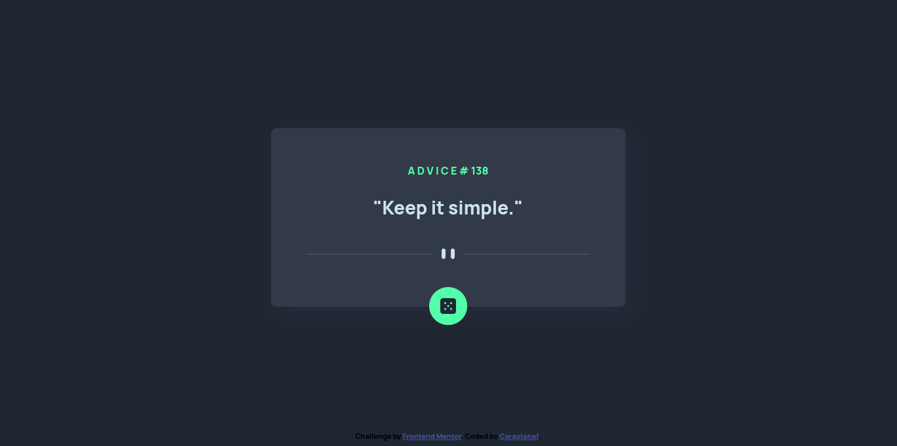

# Frontend Mentor - Advice Generator App Solution

This is a solution to the [Advice generator app challenge on Frontend Mentor](https://www.frontendmentor.io/challenges/advice-generator-app-QdUG-13db). Frontend Mentor challenges help you improve your coding skills by building realistic projects.

## Table of contents

* [Overview](#overview)
  * [Screenshot](#screenshot)
  * [Links](#links)
* [My process](#my-process)
  * [Built with](#built-with)
  * [What i learned](#what-i-learned)
  * [Continued development](#continued-development)
* [Author](#author)

## Overview

### Screenshot



### Links

* Solution URL: [Solution](https://www.frontendmentor.io/challenges/advice-generator-app-QdUG-13db/hub/third-party-advice-api-orMEEv0Pyc)
* Live Site URL: [Live Site](https://caraplana1.github.io/AdviceGeneratorApp/)

## My process

### Built With

* Semantic HTML5 markup
* CSS custom properties
* CSS Grid
* Vanilla JavaScript

### What I learned

I learning fetching data from a third party api and displaying in the html document.

I've achive this with the followings lines of code:
```js
fetch("https://api.adviceslip.com/advice").then(response => {
	return response.json()
}).then(advice => {
	var data = advice.slip

	id.innerText = "A D V I C E  # " + data.id
	text.innerText = '"' + data.advice + '"'
}).catch(error => {
	console.log(error)
})
```

### Continued development

I would like to improve my js skills as well to develop bigger projects.

### Usefull resources

* [MDN Web Docs](https://developer.mozilla.org/en-US/) - This helped me to some custom properties in css such `box-shadow` and `hover`
* [GRID: A simple visual cheatsheet for CSS Grid Layout](https://grid.malven.co/) - This helped me with css grid properties and positioning.
* [Display Random Advice On Your Website or Web App Using Advice Slip JSON API](https://www.youtube.com/watch?v=2AfzKmgqWUE) - This helped me fetching the data from the advice slip api.

## Author

* Twitter - [caraplana1](https://twitter.com/caraplana1)

* Github - [caraplana1](https://github.com/caraplana1)

* FrontendMentor - [caraplana1](https://www.frontendmentor.io/profile/caraplana1)